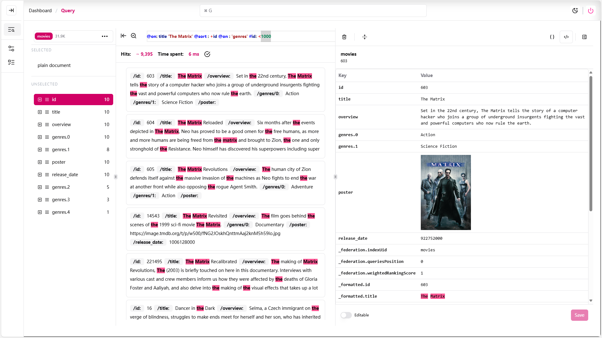
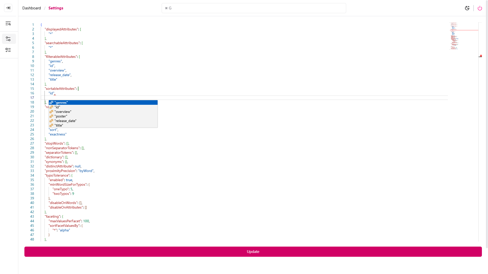
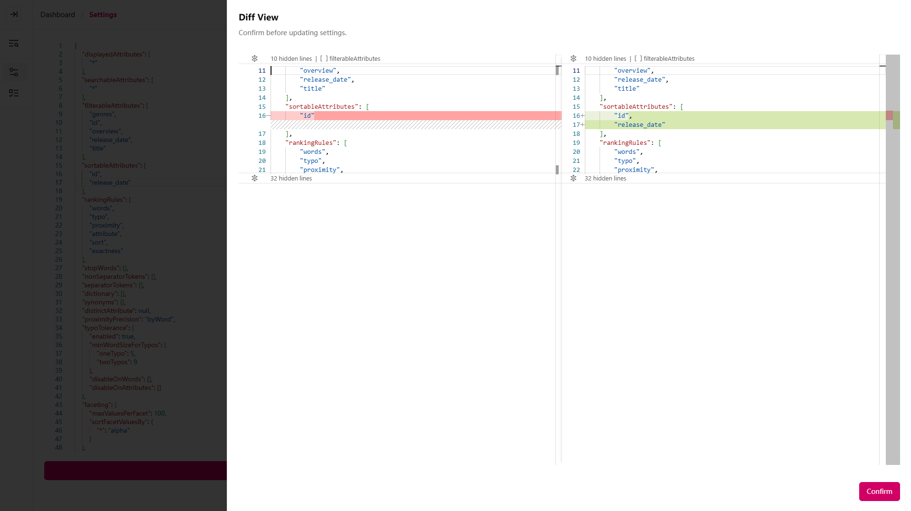
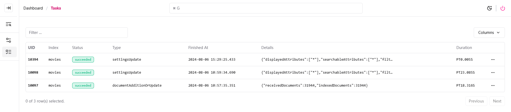

<p align="center">
 
 <h1 align="center">
  Meilisearch Query Dashboard
 </h1>
</p>

### Preview






## Simple Query DSL (Antlr4)

[See MsDsl.g4 here.](./antlr4/MsDsl.g4)

### Filter

**Operators**
* \= : Equal
* \!= : Unequal
* \> : Greater than
* \>= : Greater than or equal to
* \< : Less than
* \<= : Less than or equal to
* like: CONTAINS('%any%') | STARTS WITH('%any') | ENDS WITH('any%') in (prototype-contains-starts-ends-with-filters-0)
* q : another federation searchParams with only one attributes to search on.

```html
#<attribute> : <operator> <value>
```

---
### Sort

**Operators**
* \+ : ASC
* \- : DESC

```html
@sort : <+|-> <attribute>
```

---
### Search on

```html
@on : <attribute>
```

## Example

DSL:
```text
@on: title 'The Matrix' @sort : -id @on : 'genres' #id: <1000
```

Rendered Search params:
```json lines
{
  "q": "'The Matrix'",
  "filter": [
    "id < 1000"
  ],
  "sort": [
    "id:desc"
  ],
  "attributesToSearchOn": [
    "title",
    "genres"
  ],
//  ...
}
```